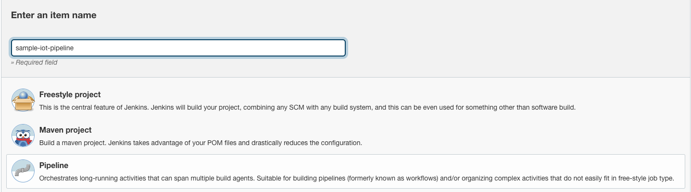
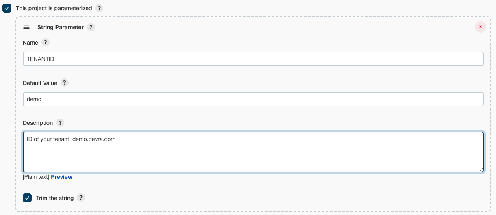
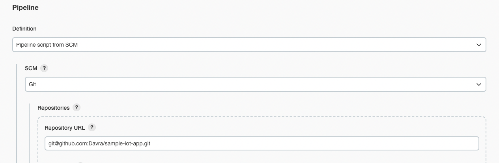

Sample IoT application
=======================================

This is a Vue App, using Vuex & Vuetify

# Getting Started
See Unit 8 of the get started units on the [Developer Portal](https://www.developer.davra.com/get-started/unit-8/) before proceeding.
### Repo Layout

* root folder
  - start.sh & Dockerfile image for standard microservie running
  - index.js - start express server to serve static files from 'public', also contains redirect to vanity url & oauth integration
  - Jenkinsfile - scripted pipeline for building and deploying the application to your Davra tenant
* public/
  - the output of the Vue build - what actually gets served(This is the output directory for when the Jenkins pipeline builds the Vue app)
* client/
  - the Vue source, see below for getting started

### Add environment variables setup

create a `.env` file in the root with the following(see .env.example also):
```
TENANT_HOST = tenant.davra.com
TARGET_HOST = microservicename.apps.tenant.davra.com(Vanity URL)
CLIENT_ID = OAuth client id from the earlier step in Unit 8
CLIENT_SECRET = OAuth client secret from the earlier step in Unit 8
```

create a `.env` file in the client directory with the following(see .env.example also):
```
VUE_APP_TENANT_HOST = Your tenant name url
VUE_APP_DAVRA_LOGIN = Your username to access your Davra tenant
VUE_APP_DAVRA_PASSWORD = Your password to access your Davra tenant
VUE_APP_LOCAL_DEV = false(set to true for local development)
VUE_APP_TOKEN = API token for your user(For local development only)
```

### Compiles and hot-reloads for development
```
cd client
npm run serve
```
### To test the server:

1. Create a `.env` in the root here based on [.env.example](.env.example) - .env also needed for production
2. Run `sh start.sh`

## Amazon ECR creditionals

In the first step of unit 8 you would have created a Docker microservice on your Davra tenant. In order for the Davra microservice manager to pull images from your ECR instance you must create a Davra secret containing your credentials, you can see how to do that [HERE](https://help.davra.com/#/custom-services?id=example-use-of-a-private-docker-registry-on-aws-ecrhttpsawsamazoncomecr). **NOTE:** After you create the Davra secret you can ignore the rest of the steps in the help documentation as your Jenkins pipeline will take care of the rest :) 

## Jenkins pipeline
#### Pre-requistes:
1. Docker installed on Jenkins instance.
2. Docker and Docker pipelines plug-in are installed
3. Repo created in ECR.
4. AWS cli v2 installed in Jenkins instance.
5. Github credentials added to Jenkins instance

#### Credentials

You need to add 2 sets of credentials to Jenkins

1. Open the home page of your Jenkins installation
2. Click “Credentials” on the left-hand menu
3. Click on “System” -> “Global credentials” and “Add Credentials”
##### AWS Credentials

1. Select the “Kind” to be “Username and password”
2. As the username, enter your AWS Access Key
3. As the password, enter your AWS Secret Key
4. As the ID, enter “sample-aws-key”

##### Davra tenant admin user credentials

1. Select the “Kind” to be “Username and password”
2. As the username, enter your Davra username
3. As the password, enter your Davra password
4. As the ID, enter “SAMPLE_APP_CREDENTIALS”

##### Create pipline

1. Open the home page of your Jenkins installation
2. Click “New Item” on the left-hand menu
3. Enter a name and selet "Pipeline" 


Next select the box that says "This project is parameterized", in total there will be 7 string parameters

1. TENANTID - ID of your tenant: id.davra.com
2. HOST - Vanity URL created in the routes section of your microservice
3. SERVICE - UUID of the microservice you created on your tenant
4. SECRET - UUID of the secret with your AWS ECR login credentials 
5. AWS_ACCOUNT_ID - Your AWS account ID
6. REGISTY NAME - Name of your AWS ECR
7. REGION - Region of your Registry

Example of TENANTID parameter:


In the "Pipeline" section select "Pipeline script from SCM" and paste in your repository, in "Bracnhes to build" enter "*/main" or whichever branch you wish to use.


In the final stage in the Jenkinsfile, ensure the job names match the names of your playwright and tenable jobs.

You are now ready to run your Jenkins Pipeline!
## Deployment

> NOTE process.env variables for Vue are only available at build time (after that they're rendered static)

1. Commit your changes
2. Run Jenkins Pipleline
3. If build was successful visit microservice URL to see your changes
